# Vigor Live WebRTC Streaming Samples

This directory contains developer integration samples demonstrating how to establish real-time WebRTC streams from cameras managed by the Vigor Connectivity platform.

## Sample Structure

The integration samples are structured by programming language:

- **[`js-browser/`](./js-browser)**: Web application (HTML/JS) integration displaying a live player in standard browsers. Runs entirely on the client-side.
- **[`python/`](./python)**: Programmatic backend integration using `aiortc` (Python WebRTC implementation) and asynchronous WebSockets/HTTP calls.
- **[`nodejs/`](./nodejs)**: Server-side integration demonstrating API calls and handling the SDP exchange via WebSockets signaling.

---

## Core Streaming Flow

Every client (regardless of language) implements the following 4-step workflow to request and establish a live stream:

```mermaid
sequenceDiagram
    participant Client as Viewer Client
    participant Cloud as Vigor Cloud API
    participant WS as Signaling Gateway (WS)
    
    rect rgb(30, 41, 59)
        note right of Client: Step 1: Authentication
        Client->>Cloud: POST /v1/auth/viewer-token (Client ID & Secret)
        Cloud-->>Client: Returns JWT access_token
    end
    
    rect rgb(15, 23, 42)
        note right of Client: Step 2: Listing available cameras
        Client->>Cloud: GET /v1/cameras (with JWT Token)
        Cloud-->>Client: Returns array of enabled Cameras
    end
    
    rect rgb(30, 41, 59)
        note right of Client: Step 3: Initializing Session
        Client->>Cloud: POST /v1/cameras/{camera_id}/sessions (with JWT Token)
        Cloud-->>Client: Returns session_id, token & ICE servers
    end
    
    rect rgb(15, 23, 42)
        note right of Client: Step 4: WebRTC & Signaling Exchange
        Client->>Client: Initialize local RTCPeerConnection
        Client->>WS: Connect to WebSocket signaling URL
        Client->>WS: Send payload: { type: "request", id: camera_id }
        WS-->>Client: Receives offer: { type: "offer", sdp: "..." }
        Client->>Client: setRemoteDescription(offer) & createAnswer()
        Client->>WS: Send payload: { type: "answer", sdp: local_sdp }
        Note over Client,WS: ICE Candidate & Media negotiation completes
        Note over Client,WS: WebRTC Media stream established!
    end
```

See individual directories for setup instructions and requirements.
