# Vigor Live WebRTC Streaming Samples

This directory contains developer integration samples demonstrating how to establish real-time WebRTC streams from cameras managed by the Vigor Connectivity platform using a secure Backend + Frontend architecture.

## Sample Structure

The integration samples are structured as follows:

- **[`js-browser/`](./js-browser)**: Web player interface (HTML/JS) displaying the live camera video stream in standard browsers. Connects to the backend server to fetch the Viewer Token, and performs WebRTC negotiation directly.
- **[`nodejs/`](./nodejs)**: Lightweight server-side Node.js backend server. Securely handles credentials to request Viewer JWT Tokens and serves the web player UI.
- **[`python/`](./python)**: Lightweight server-side Python backend server. Securely handles credentials to request Viewer JWT Tokens and serves the web player UI.

---

## Secure Production Streaming Flow

To protect your Vigor Project's Client Secret, your application should separate token generation (Backend) from video streaming (Frontend/Browser):

```mermaid
sequenceDiagram
    participant Browser as Client Browser (HTML/JS)
    participant Backend as Backend Server (Node.js/Python)
    participant Cloud as Vigor Cloud API
    
    rect rgb(30, 41, 59)
        note right of Browser: Step 1: Secure Token Retrieval
        Browser->>Backend: GET /api/viewer-token
        Backend->>Cloud: POST /v1/auth/viewer-token (Client ID & Secret)
        Cloud-->>Backend: Returns 15-minute Viewer JWT Token
        Backend-->>Browser: Returns token
    end
    
    rect rgb(15, 23, 42)
        note right of Browser: Step 2: Querying Cameras
        Browser->>Cloud: GET /v1/cameras (with Viewer Token)
        Cloud-->>Browser: Returns array of enabled Cameras
    end
    
    rect rgb(30, 41, 59)
        note right of Browser: Step 3: Initializing Session
        Browser->>Cloud: POST /v1/cameras/{camera_id}/sessions (with Viewer Token)
        Cloud-->>Browser: Returns session_id, token & ICE servers
    end
    
    rect rgb(15, 23, 42)
        note right of Browser: Step 4: direct WebRTC & Signaling Exchange
        Browser->>Browser: Initialize RTCPeerConnection
        Browser->>Cloud: Connect WebSocket signaling
        Browser->>Cloud: Send "request" frame
        Cloud-->>Browser: Receives SDP Offer from Edge Gateway
        Browser->>Browser: setRemoteDescription & createAnswer
        Browser->>Cloud: Send SDP Answer
        Note over Browser,Cloud: WebRTC Media stream established!
    end
```

See individual directories for setup instructions and requirements.
